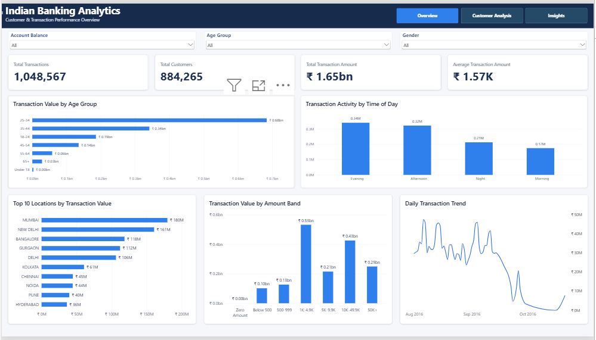
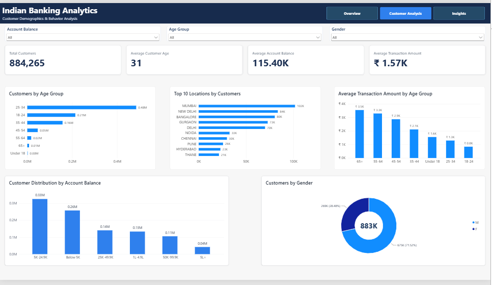
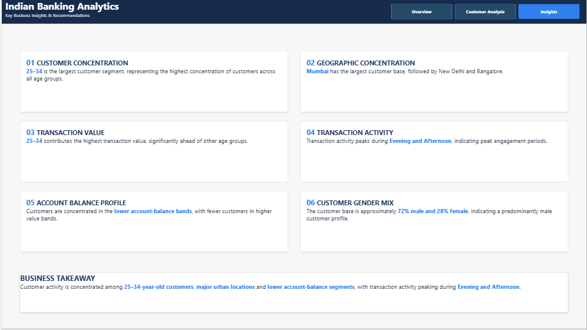

# Indian Banking Customer Transaction Analytics

An end-to-end banking data analytics project analyzing over **1 million customer transactions** using **Python, Snowflake, SQL, and Power BI**. The project covers data cleaning, cloud data loading, SQL analysis, KPI development, and interactive dashboarding to identify customer and transaction patterns.

## Tech Stack

- Python (Pandas, NumPy)
- Snowflake
- SQL
- Power BI
- Jupyter Notebook
- AWS S3

## Project Workflow

**Raw Banking Data → Python Data Cleaning & EDA → AWS S3 → Snowflake → SQL Analysis → Power BI Dashboard**

### 1. Data Cleaning & Preparation

Python and Pandas were used to:
- Inspect and clean the raw banking transaction dataset
- Handle missing and invalid values
- Clean customer demographic information
- Create customer age groups
- Create transaction time-of-day categories
- Create account balance and transaction amount bands
- Prepare the processed dataset for analysis

### 2. Snowflake Data Warehouse

The cleaned dataset was loaded into Snowflake using an AWS S3 stage.

Snowflake implementation included:
- Database and schema creation
- Warehouse configuration
- CSV file format configuration
- AWS S3 stage integration
- `COPY INTO` for data loading
- SQL-based analytical queries

### 3. SQL Analysis

SQL analysis included:
- Overall transaction KPIs
- Customer demographic analysis
- Age-group transaction analysis
- Top locations by transaction value
- Monthly transaction trends
- Month-over-month growth
- Customer spending analysis using window functions
- Time-of-day transaction analysis
- Cumulative location contribution analysis

SQL concepts used include **CTEs, window functions, DENSE_RANK, LAG, CASE, aggregations, date functions, and NULL handling**.

## Power BI Dashboard

The final Power BI report contains three pages:

### Overview

Provides a high-level view of transaction performance, including:
- 1,048,567 transactions
- 884,265 customers
- ₹1.65bn total transaction value
- ₹1.57K average transaction amount
- Transaction trends by age group, location, time of day, and transaction amount band

### Customer Analysis

Analyzes:
- Customer age distribution
- Geographic customer concentration
- Account balance distribution
- Average transaction amount by age group
- Customer gender distribution

### Key Insights

Key findings include:
- Customers aged **25–34** form the largest customer segment.
- **Mumbai** has the largest customer base, followed by New Delhi and Bangalore.
- The **25–34** age group contributes the highest transaction value.
- Transaction activity peaks during the **Evening and Afternoon**.
- Customers are concentrated in lower account-balance segments.
- The customer base is approximately **72% male and 28% female**.

## Repository Structure

    indian-banking-customer-transaction-analytics/
    ├── data/
    ├── images/
    │   ├── 01_overview.png
    │   ├── 02_customer_analysis.png
    │   └── 03_insights.png
    ├── notebooks/
    │   └── 01_data_cleaning_eda.ipynb
    ├── sql/
    │   ├── 01_snowflake_setup.sql
    │   ├── 02_data_loading.sql
    │   └── 03_banking_analysis.sql
    ├── powerbi/
    │   └── Indian_Banking_Analytics_Dashboard.pbix
    └── README.md

## Dashboard Features

- Interactive slicers for account balance, age group, and gender
- Cross-filtering between visuals
- Synced slicers across analytical pages
- KPI cards for major banking metrics
- Customer segmentation and demographic analysis
- Transaction trend and geographic analysis
- Dedicated business insights page

## Project Outcome

This project demonstrates an end-to-end analytics workflow from **data preparation and cloud data warehousing to SQL analysis and business intelligence reporting**, using a banking transaction dataset containing more than **1 million records**.